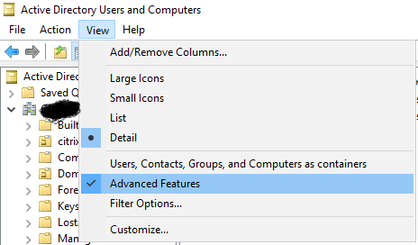
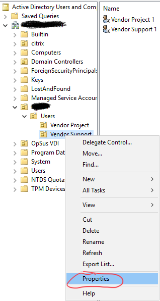
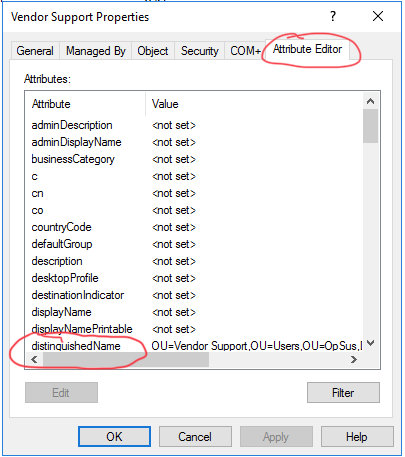

# OpSus_Vendor_Acct_Status

Manages vendor accounts located in specified OUs by moving and/or disabling accounts if no logins occur for a specified period.

## Table of Contents

- [Requirements](#requirements)
- [Definitions](#definitions)
  - [OU.ShortTerm](#oushortterm)
  - [OU.LongTerm](#oulongterm)
  - [ValidPeriodHours.ShortTerm](#validperiodhoursshortterm)
  - [ValidPeriodHours.LongTerm](#validperiodhourslongterm)
- [Obtaining distinguishedName](#obtaining-distinguishedname)

## Requirements

1. Run `Set-VendorAccountStatus.ps1` from a domain controller.
2. Create `settings.json` file in script directory.

   **Example:**

   ```json
   {
     "OU": {
       "ShortTerm": "OU=Vendor Support,OU=Users,OU=Contoso,DC=FABRIKAM,DC=COM",
       "LongTerm": "OU=Vendor Project,OU=Users,OU=Contoso,DC=FABRIKAM,DC=COM"
     },
     "ValidPeriodHours": {
       "ShortTerm": 72,
       "LongTerm": 2160
     }
   }
   ```

## Definitions

### OU.ShortTerm

Specify the distinguishedName of the OU that uses a shorter valid period for user accounts. Users from the longer validity period will move here when they are aged out.

**Example:** `"OU=Vendor Support,OU=Users,OU=Contoso,DC=FABRIKAM,DC=COM"`

### OU.LongTerm

Specify the distinguishedName of the the OU that holds the longer valid period for user accounts.

**Example:** `"OU=Vendor Project,OU=Users,OU=Contoso,DC=FABRIKAM,DC=COM"`

### ValidPeriodHours.ShortTerm

Specify the number of hours, as an integer, since the last logon for the shorter term OU which will ignore processing.

**Example:** If you want to ignore users that have logged in within the past seven days, use 7 × 24 = `168`.

### ValidPeriodHours.LongTerm

Specify the number of hours, as an integer, since the last logon for the longer term OU which will ignore processing.

**Example:** If you want to ignore users that have logged in within the past 90 days, use 90 × 24 = `2160`.

## Obtaining distinguishedName

1. Open Active Directory Users and Computers.
2. Enable Advanced Features (**_View &rarr; Advanced Features_**).

   

3. Right-click desired OU and select **Properties**.

   

4. Select **Attribute Editor** tab and locate **distinguishedName** attribute.

   
